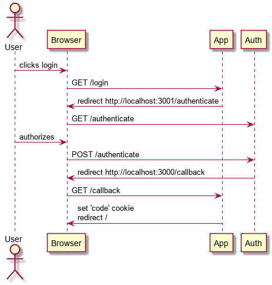

Very contrived Next.js application to simulate an authentication flow that uses next-cookies to provide server and client side with auth code

## Starting

Start the Next.js app
```bash
npm run dev
```

Start the contrived authentication server:
```bash
npm run dev-auth
```

Open a browser to http://localhost:3000

## Flow

The following diagram shows the contrived replica of an OAuth2 flow simulated by this application and its companion authentication server:

